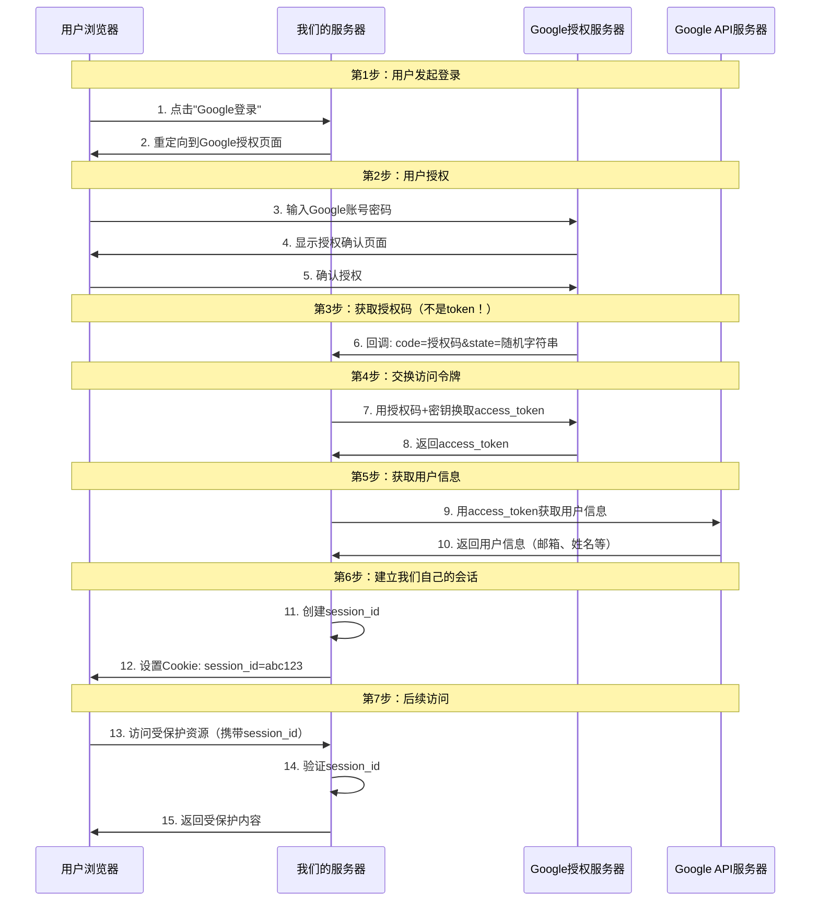

# Google OAuth2 认证实践

这个项目演示了如何实现 Google OAuth2 登录，并澄清了一些常见的误解。

## 🔄 OAuth2 流程详解

### ❌ 常见误解

很多人认为：**Google 登录成功后回调给我们服务器一个 token，用户用这个 token 访问我们服务器**

### ✅ 实际流程

Google OAuth2 是一个**多步骤**的授权流程，涉及**多个不同的令牌**：



## 🔑 关键概念澄清

### 1. 授权码 (Authorization Code)

- **什么时候**：Google 回调时给我们的
- **内容**：一次性使用的临时代码
- **用途**：只能用来换取 access_token
- **有效期**：5-10 分钟
- **示例**：`4/0AX4XfWh...`

```bash
# Google回调URL示例
http://localhost:8080/auth/google/callback?code=4/0AX4XfWh...&state=random123
```

### 2. 访问令牌 (Access Token)

- **什么时候**：我们用授权码向 Google 换取的
- **内容**：用于访问 Google API 的令牌
- **用途**：调用 Google API 获取用户信息
- **有效期**：1 小时
- **示例**：`ya29.a0ARrdaM...`

```bash
# 使用access_token调用Google API
curl -H "Authorization: Bearer ya29.a0ARrdaM..." \
     "https://www.googleapis.com/oauth2/v2/userinfo"
```

### 3. 会话 ID (Session ID)

- **什么时候**：我们服务器创建的
- **内容**：我们生成的随机字符串
- **用途**：用户访问我们服务器的凭据
- **有效期**：24 小时（可配置）
- **示例**：`f8d7e6c5b4a3...`

```bash
# 用户访问我们服务器时的Cookie
Cookie: session_id=f8d7e6c5b4a3...
```

## 📋 详细流程分析

### 第 1 步：用户点击登录

```go
// 用户访问：http://localhost:8080/login/google
func googleLoginHandler(c *gin.Context) {
    // 生成防CSRF的随机state
    oauthState := generateStateOauthCookie()

    // 重定向到Google授权页面
    url := googleOauthConfig.AuthCodeURL(oauthState, oauth2.AccessTypeOffline)
    c.Redirect(http.StatusTemporaryRedirect, url)
}
```

**重定向 URL 示例：**

```
https://accounts.google.com/o/oauth2/auth?
  client_id=你的客户端ID&
  redirect_uri=http://localhost:8080/auth/google/callback&
  response_type=code&
  scope=email+profile&
  state=random123
```

### 第 2 步：Google 回调（授权码）

```go
func googleCallbackHandler(c *gin.Context) {
    // 接收授权码
    code := c.Query("code")  // 这是授权码，不是access_token！

    // 用授权码换取access_token
    token, err := googleOauthConfig.Exchange(context.Background(), code)
    // token.AccessToken 才是真正的访问令牌
}
```

### 第 3 步：获取用户信息

```go
func getUserInfoFromGoogle(accessToken string) (*GoogleUser, error) {
    // 用Google的access_token调用Google API
    response, err := http.Get(
        "https://www.googleapis.com/oauth2/v2/userinfo?access_token=" + accessToken
    )
    // 返回用户的Google账号信息
}
```

### 第 4 步：创建我们的会话

```go
// 生成我们自己的会话ID
sessionID := generateStateOauthCookie()

// 存储用户信息
sessions[sessionID] = *user

// 设置Cookie给用户
c.SetCookie("session_id", sessionID, 86400, "/", "localhost", false, true)
```

### 第 5 步：用户后续访问

```go
func apiUserHandler(c *gin.Context) {
    // 用户访问我们的API时，携带的是我们的session_id
    sessionID, err := c.Cookie("session_id")

    // 我们验证的是自己的session，不是Google的token
    if user, exists := sessions[sessionID]; exists {
        c.JSON(http.StatusOK, gin.H{"user": user})
    }
}
```

## 🎯 关键理解

### ❌ 错误理解：

> "Google 给我们 token，用户用 Google 的 token 访问我们服务器"

### ✅ 正确理解：

> "Google 给我们授权码 → 我们用授权码换取 Google 的 access_token → 我们用 Google 的 access_token 获取用户信息 → 我们创建自己的会话 → 用户用我们的会话访问我们的服务器"

## 🔒 安全机制

### 1. 为什么不直接给 access_token？

- **安全性**：授权码模式确保 access_token 不会暴露给浏览器
- **验证性**：服务器必须用 client_secret 才能换取 token
- **控制性**：我们可以控制自己的会话生命周期

### 2. 为什么要创建自己的会话？

- **独立性**：不依赖 Google token 的有效期
- **权限控制**：可以添加我们自己的权限逻辑
- **用户体验**：用户不需要频繁重新授权

### 3. state 参数的作用

```go
// 防止CSRF攻击
oauthState := generateStateOauthCookie()
c.SetCookie("oauthstate", oauthState, 3600, "/", "localhost", false, true)

// 验证回调时的state
if c.Query("state") != oauthState {
    // 可能是CSRF攻击
    return
}
```

## 🚀 快速开始

### 1. 配置 Google OAuth2

```yaml
# config.yaml
google:
  client_id: "你的Google客户端ID"
  client_secret: "你的Google客户端密钥"
```

### 2. 启动服务器

```bash
go run main.go
```

### 3. 测试流程

```bash
# 1. 访问登录页面
curl http://localhost:8080/

# 2. 发起Google登录
curl http://localhost:8080/login/google
# 会重定向到Google授权页面

# 3. 授权后Google会回调
# http://localhost:8080/auth/google/callback?code=...&state=...

# 4. 访问用户信息API
curl -b cookies.txt http://localhost:8080/api/user
```

## 📊 数据流对比

| 阶段 | Google → 我们  | 我们 → 用户           | 用户 → 我们           |
| ---- | -------------- | --------------------- | --------------------- |
| 回调 | `授权码`       | -                     | -                     |
| 换取 | `access_token` | -                     | -                     |
| 会话 | -              | `session_id` (Cookie) | -                     |
| 访问 | -              | -                     | `session_id` (Cookie) |

## ⚠️ 注意事项

1. **授权码** ≠ **访问令牌** ≠ **会话 ID**
2. Google 的 access_token 只用于调用 Google API
3. 用户访问我们服务器用的是我们自己的 session_id
4. 整个流程中有 3 个不同的令牌/ID 在流转

## 🔗 相关资源

- [Google OAuth2 文档](https://developers.google.com/identity/protocols/oauth2)
- [OAuth2 RFC 6749](https://tools.ietf.org/html/rfc6749)
- [Authorization.md - 认证方案总结](../Authorization.md)

---

**总结：Google OAuth2 是一个复杂的多步骤流程，涉及多个不同的令牌。理解每个令牌的作用和流转过程对于正确实现 OAuth2 至关重要。**
